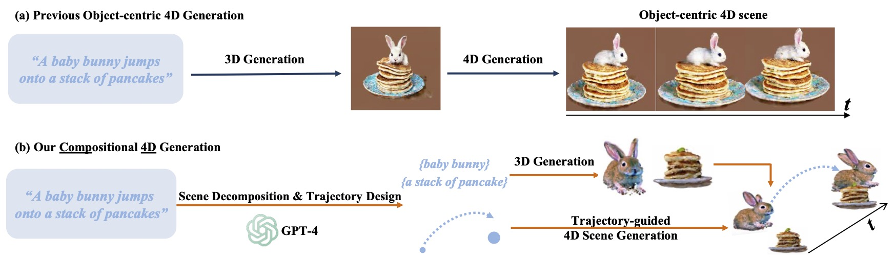

# Comp4D: LLM-Guided Compositional 4D Scene Generation

The official implementation of paper "Comp4D: LLM-Guided Compositional 4D Scene Generation".

[[Project Page]](https://vita-group.github.io/Comp4D/) | [[Video (narrated)]](https://www.youtube.com/watch?v=9q8SV1Xf_Xw) | [[Video (results)]](https://www.youtube.com/watch?v=gXVoPTGb734) | [[Paper]](https://github.com/VITA-Group/Comp4D/blob/main/assets/Comp4D.pdf) | [[Arxiv]](https://arxiv.org/abs/2403.16993)

## News

- 2024.4.1:  Released code!
- 2024.3.25:  Released on arxiv!

## Overview



As show in figure above, we introduce **Comp**ositional **4D** Scene Generation. Previous works concentrate on object-centric 4D objects with limited movement. In comparison, our work extends the boundaries to the demanding task of compositional 4D scene generation. We integrate GPT-4 to decompose the scene and design proper trajectories, resulting in larger-scale movements and more realistic object interactions.

<!-- ## Representative Results

<table class="center">
  <td><video src="https://github.com/VITA-Group/Comp4D/blob/main/assets/butterfly_flower1.mp4" width="170"></video>
  <td><video src="https://github.com/VITA-Group/Comp4D/blob/main/assets/butterfly_flower2.mp4" width="170"></video>
  <tr>
  <td><a href="https://github.com/AILab-CVC/VideoCrafter/assets/18735168/1a57edd9-3fd2-4ce9-8313-89aca95b6ec7"><video src=assets/butterfly_flower1.mp4 width="170"></td>
  <td><a href="https://github.com/AILab-CVC/VideoCrafter/assets/18735168/d671419d-ae49-4889-807e-b841aef60e8a"><video src=assets/butterfly_flower2.mp4 width="170"></td>
  <tr>
  <td style="text-align:center;" width="170">"a black swan swims on the pond"</td>
  <td style="text-align:center;" width="170">"a girl is riding a horse fast on grassland"</td>

</table > -->

## Setup
```bash
conda env create -f environment.yml
conda activate Comp4D
pip install -r requirements.txt

# 3D Gaussian Splatting modules, skip if you already installed them
# a modified gaussian splatting (+ depth, alpha rendering)
git clone --recursive https://github.com/ashawkey/diff-gaussian-rasterization
pip install ./diff-gaussian-rasterization
pip install ./simple-knn
```

## Example Case
#### Prompt Case
"a butterfly flies towards the flower"

#### Compositional Scene training
```
python train_comp.py --configs arguments/comp_butterfly_flower_zs.py --expname butterflyflower_exp --cfg_override 100.0 --image_weight_override 0.02 --nn_weight 1000 --with_reg  --loss_dx_weight_override 0.005
```
--- 
We provide a quick overview of some important arguments:  
- `--expname`:  Experimental path.
- `--configs`: Configuration of scene traning including prompt, object identity, object scales, trajectory. You can also use [VideoCrafter](https://github.com/AILab-CVC/VideoCrafter) in replace of Zeroscope for video-based diffusion model.
- `--image_weight`: Weight of sds loss from image-based diffusion model.
- `--nn_weight`: Weight of k-nn based rigidity loss.
- `--loss_dx_weight`: Weight of regularization acceleration loss.


#### Rendering
```
python render_comp_video.py --skip_train --configs arguments/comp_butterfly_flower_zs.py --skip_test --model_path output_demo/date/butterflyflower_exp_date/ --iteration 3000
```


## Static Assets Preparation

We release a set of pre-generated static assets in `data/` directory. During training we keep the static 3D Gaussians fixed and only optimize the deformation modules. We refered to the first two stages of [4D-fy](https://github.com/sherwinbahmani/4dfy) to generate the static 3D objects. Then we convert them to point clouds (in `data/`) which are used to initialize 3D Gaussians. Thanks the authors for sharing their awesome work!

#### Example case
```

# cd /path_to_4dfy/
# seed=0
# gpu=0

## Stage 1
# python launch.py --config configs/fourdfy_stage_1_low_vram.yaml --train --gpu $gpu exp_root_dir=output/ seed=$seed system.prompt_processor.prompt="a flower"

## Stage 2
# ckpt=output/fourdfy_stage_1_low_vram/a_flower@timestamp/ckpts/last.ckpt
# python launch.py --config configs/fourdfy_stage_2_low_vram.yaml --train --gpu $gpu exp_root_dir=output/ seed=$seed system.prompt_processor.prompt="a flower" system.weights=$ckpt

## Post-Process. Convert to mesh file.
# python launch.py --config output/fourdfy_stage_2_low_vram/a_flower@timestamp/configs/parsed.yaml --export --gpu $gpu \
#   resume=output/fourdfy_stage_2_low_vram/a_flower@timestamp/ckpts/last.ckpt system.exporter_type=mesh-exporter \
#   system.exporter.context_type=cuda system.exporter.fmt=obj
## saved to output/fourdfy_stage_2_low_vram/a_flower@timestamp/save/iterations-export/

## Convert to point cloud.
# cd /path_to_Comp4D/
# python mesh2ply_8w.py /path_to_4dfy/output/fourdfy_stage_2_low_vram/a_flower@timestamp/save/iterations-export/model.obj data/a_flower.ply

```


## Acknowledgement

This work is built on many amazing research works and open-source projects. Thanks to all the authors for sharing!

- https://github.com/sherwinbahmani/4dfy
- https://github.com/hustvl/4DGaussians
- https://github.com/dreamgaussian/dreamgaussian
- https://github.com/graphdeco-inria/gaussian-splatting
- https://github.com/graphdeco-inria/diff-gaussian-rasterization
- https://github.com/threestudio-project/threestudio

## Citation

If you find this repository/work helpful in your research, please consider citing the paper and starring the repo ⭐.
```
@article{xu2024comp4d,
  title={Comp4D: LLM-Guided Compositional 4D Scene Generation},
  author={Xu, Dejia and Liang, Hanwen and Bhatt, Neel P and Hu, Hezhen and Liang, Hanxue and Plataniotis, Konstantinos N and Wang, Zhangyang},
  journal={arXiv preprint arXiv:2403.16993},
  year={2024}
}
```
